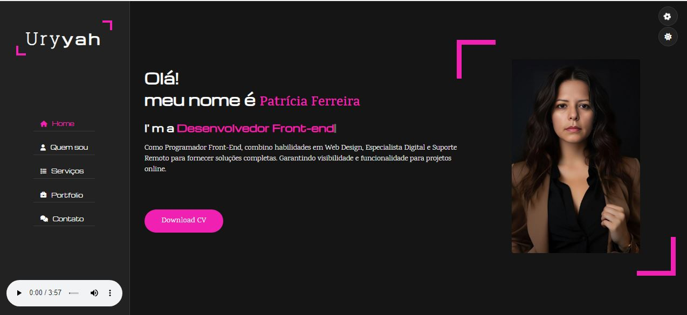

<h1 align="center">
  💻 Portfólio - Patricia M. Ferreira
</h1>

<h4 align="center">
  <a href="https://patriciamarpaulino.github.io/PortfolioPatricia/" target="_blank" rel="noopener noreferrer">
    Visite o Projeto
  </a>
</h4>

## 💻 Seções

O site é composto por cinco seções:

- **Home:** Nele temos uma breve apresentação;
- **Quem sou:** Nessa seção tenho uma descrição dizendo um pouco sobre quem sou;
- **serviços:** Abordo alguns  serviços na área de desenvolvimento e design;
- **Portfolio:** Apresenta alguns projetos desenvolvidos e com link direto para os respectivos códigos no GitHub;
- **Contato:** Exibe através de icones clicaveis para as redes sociais e um formulário de contato;
- **Adicionais(play de musica| um botao de downloade de CV:** o play de musica para trazer uma experiência agradavél e o botão de dw com senha apenas para acesso a recrutadores;

---

## 👨🏻‍💻 Tecnologias utilizadas

Para o desenvolvimento deste site utilizei as seguintes tecnologias:

- HTML;
- CSS;
- JavaScript;

---

<h2>🦄 Patricia Ferreira</h2>

